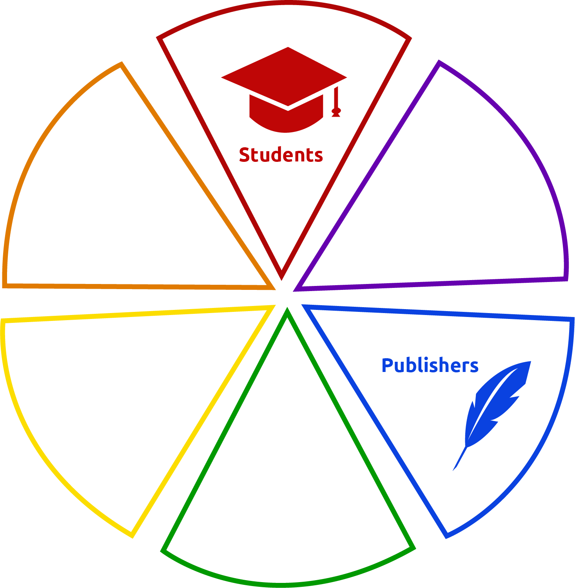

<body style="background-color: rgb(43, 43, 43); color:white">

# Eudoxus Evaluation

## Top 4 Usablity Issues

* Noisy, ungraceful design.
* Extensive usage of text, right in the middle of the screen. It's common knowledge, that the user does **not read** but **scans** instead.
* The font used is especially small, quite so in the side-navigation bar individual links. Also, the coloring choices are very poor.
* The title does not **explicitly** reflect the application's purpose. It uses many and mostly unnecessary words, that the user should not be obliged to read.

    
* It cannot be easily ascertained where the individual links lead to. In addition, many links can be confused with one another, when it comes to their usage or destination.

**Honorable Mention**: It *can* be hard for each target group to discern where their goal lies.

---
## Nielsen's Laws Broken

1. There is no way for the user to trace back his actions.  **Visibility of System Status | Control** 
2. Links used in text sections do not have the color determined by convention. They are orange, rather than blue.  **Consistency and Standards** 
3. Non-explicit and clear links to individual functionalities for each target group. **Aesthetic and minimalist design | Recognition rather than recall**
4. Extensive use of text, intertwined with big chunks of **useless** information. **Aesthetic and minimalist design**
5. Blurry, Different-styled icons, inconsistent subtitles.  **Consistency | Aesthetic and minimalist design** 
6. The FAQ section is badly written. One cannot easily find the answer to his possible inquiries. Moreover, the incorrect usage of color causes eye strain. **Help and Documentation**
7. The website is structured using a *deep hierarchy* implementation. This makes it very hard for the user to navigate through the website. **Flexibility and Efficiency**
8. The user upon clicking on a side-bar link, instead of being immediately transported to the expected destination, is taken to a proxy page and has to click a very similar link in order to finally reach his destination. **Flexibility and Efficiency**
9. The informational videos are oddly placed and thus, most users will gloss over them. Although it is clear and concise, it could be deemed as old-fashioned. **Recognition rather than recall**
10.  

---
## Possible Solutions

1. Breadcrumb functionality.
2. Usage of correct colour convention.
3. Distinct sections for each user with appropriate sub-menus/pages.  
    Proposed Solutions:
    * Radial Menu
        

        (a work **very** much in progress)
    * Target group sections (grid)
4. Said text contains information about the innovation "achieved" by the website, its history, and other, not immediately useful information. This kind of text could be placed in a section on its own. For example "About Us", or something of the sort.

</body>